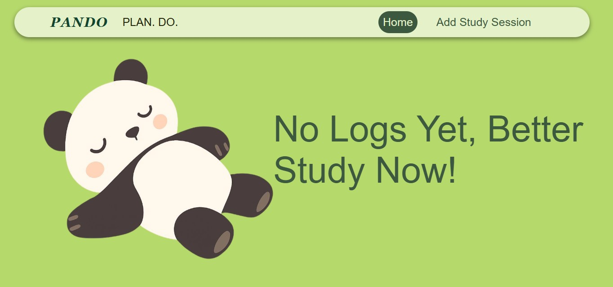
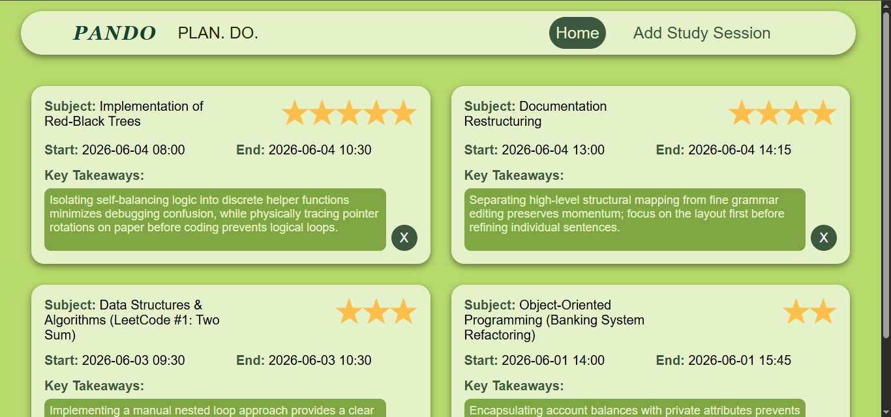
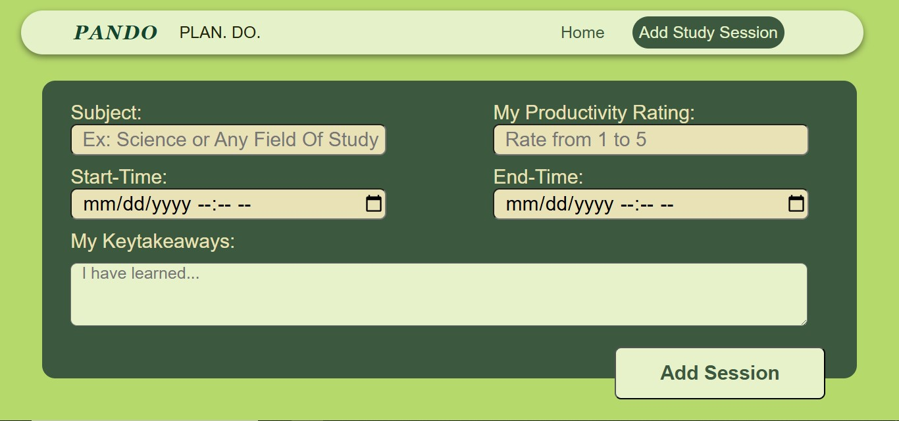
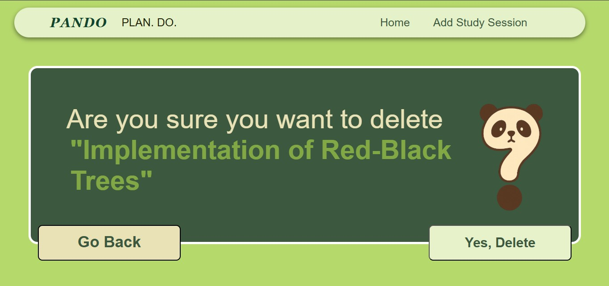

# Pando - Plan. Do. 
> A self-directed Flask Project for logging and tracking daily study sessions.

## Features
- Navigation Bar for navigating between pages
- Main Hub for showing either Empty Logs or display Study Sessions by Card
- Adding a Study Session with Subject, Start and End Time, Key Takeaways, and Productivity Rating
- Confirmation before Deletion of Session Log

## Tech Stack
- Python / Flask
- SQLite
- Jinja2
- Vanilla CSS

## How to Run
1. Clone the repository
2. Navigate to `project5_study_tracker/`
3. Create a virtual environment: `python -m venv .venv`
4. Activate it: `.venv\Scripts\activate` (Windows) or `source .venv/bin/activate` (Mac/Linux)
5. Install dependencies: `pip install -r requirements.txt`
6. Create a `.env` file with: `SECRET_KEY=your_secret_key_here`
7. Run: `python session_app.py`
8. Open `http://127.0.0.1:5000` in your browser

## What I learned
- Implemented Flask Routing - Uses the @app.route() decorators to map URLs to Python functions that handles specific actions that the user requests.
- HTTP Request and Response Cycle - GET method request serves the pages and forms that requires information to the user. POST method request submits the form data to the server where Flask will read it via request.form and it will process it first before redirecting.
- Implemented Separation of Python Files - session_app.py and database.py are separate in order to keep the maintenance and debugging of code easier. session_app.py handles all the routing and presentation of the website logic, while database.py handles the CRUD operations on SQLite.
- What I could improve on is to never name route functions the same as imported database functions which causes naming conflicts.
- Learned the difference between client-side and server-side validation - Input validations has two working mechanisms. One is the client-side which is basically the html tooltip dictating and checking if the inputted data corresponds and follows the rules in the input. These are built through the required and min/max rules. But server-side validation are for when users bypass those security. server-side validation is like the second line of defense for input validations.
- get_session returns None instead of [] because a [] means an empty list, but get_session only returns a single session, so if it doesn't exist, then it should be None
- init_db() placement matters for WSGI imports vs script execution - I learned that there should only be one explicit call for init_db so that it would run regardless of how the study tracker app started. Whether through WSGI Imports or Local Execution through cloning.

## What I would add in the future
- Built-in session timer - A floating button that starts and stops a timer, automatically filling in start and end times on the add session form.
- We could also add Subject Goals Per Week
- We could also add a Table showing Productivity Chart based on the previous Productivity Ratings

## Deployment Note
- Pando was a smaller, reduced-scoped project originally built before Orchid. It served as my practice ground for core CRUD Operations which I carried forward into Orchid. After completing Orchid's pre deployment test, security hardening, and improved data handling, I returned to Pando and applied that discipline:  error handling, server-side validation, environment variable management, and user feedback through flash message. Pando was not deployed for Orchid serves as my main portfolio piece.

## Preview

