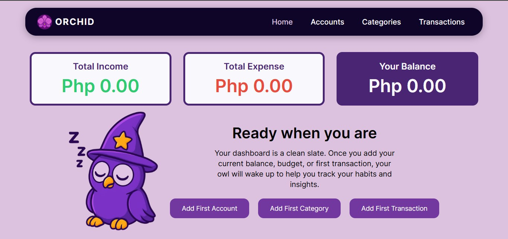
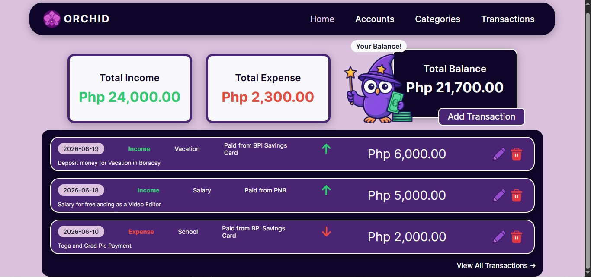
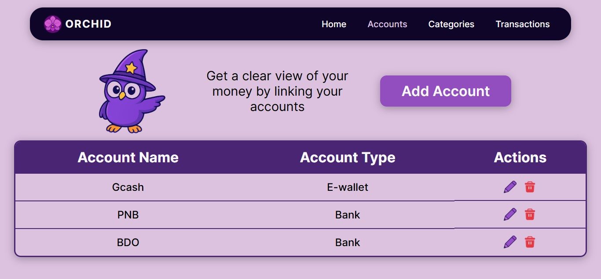
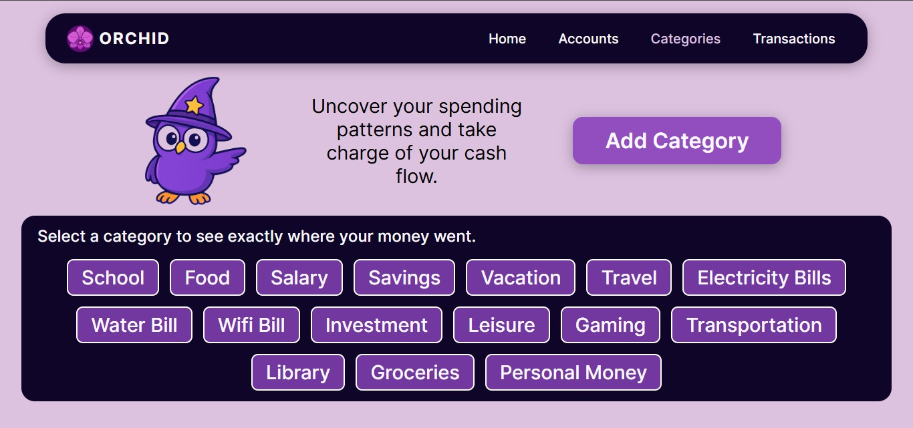
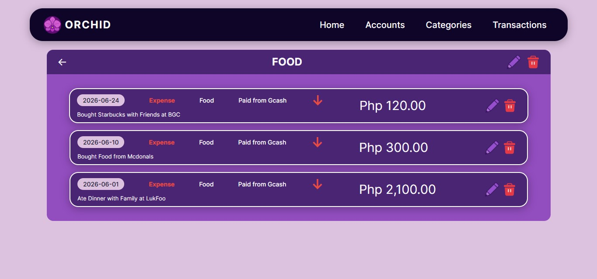
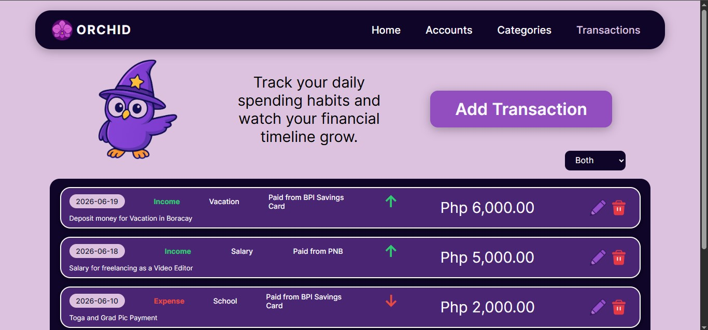

# Orchid - Growth in every entry

A self-directed Flask project for tracking personal finances.

Orchid tracks your finances where accounts hold your money, categories organize your spending, and transactions record what happened.

## Features

- **Home Page** — Displays total income, total expense, current balance, and a preview of the 5 most recent transactions
- **Accounts Page** — Create, edit, and delete financial accounts (Cash, E-wallet, Bank, Credit Card)
- **Categories Page** — Create, edit, and delete spending categories; click a category to view all transactions under it
- **Transactions Page** — Create, edit, and delete transactions; filter by income, expense, or both

## How to Run

1. Clone the repository
2. Navigate to `project6_finance_tracker/`
3. Run: `python finance_app.py`
4. Open `http://127.0.0.1:5000` in your browser

## What I Learned

- **Modals over page navigation** — Instead of redirecting to a new page for every action, modals provide a faster and cleaner experience for creating, editing, and deleting records without leaving the current page
- **Jinja2 template inheritance** — Using `` and `` allows every page to inherit the navbar and base layout from `base.html`, removing duplication and keeping templates clean and maintainable
- **Jinja2 conditions and syntax** — Learning ``, ``, ``, and `` made dynamic rendering of data possible across all pages
- **Empty strings vs None in Python** — When a form submits an empty field, Flask receives an empty string, not `None`. Query filters that check `if value is not None` will still apply the filter with an empty string, causing incorrect results. Using `or None` explicitly converts empty strings to `None` so filters behave correctly
- **SQL column ambiguity in JOINs** — When joining multiple tables that share a column name, SQL requires table-qualified column names (e.g. `Transactions.category_id`) to avoid ambiguous column errors

## What I Would Add in the Future

- **Orchid petal category view** — Each category displayed as an orchid where petal size reflects transaction volume; hovering a petal previews the transaction, clicking opens the full detail
- **Dynamic balance color** — Balance label turns red when negative, green when positive
- **Spending insights** — Charts showing spending by category and monthly income vs expense trends
- **Budget limits per category** — Set a monthly budget per category with a visual indicator when approaching or exceeding the limit

## Preview 

